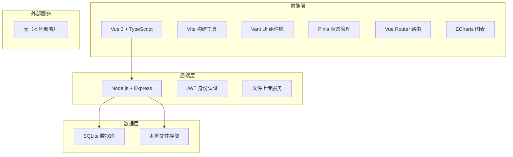
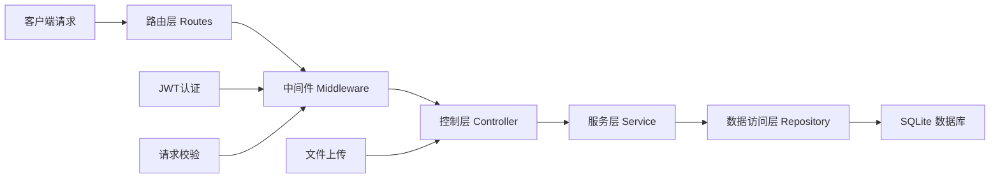

## 1. 架构设计



## 2. 技术栈说明

### 前端技术栈
- **框架**：Vue 3.x（Composition API） + TypeScript 5.x
- **构建工具**：Vite 5.x（快速开发构建）
- **UI组件库**：Vant 4.x（移动端UI组件库，适配H5）
- **状态管理**：Pinia 2.x（Vue官方推荐，替代Vuex）
- **路由管理**：Vue Router 4.x
- **图表库**：ECharts 5.x（养护数据可视化）
- **日期处理**：dayjs 2.x（轻量级日期库）
- **HTTP请求**：axios 1.x（请求拦截、响应拦截）
- **样式方案**：SCSS + CSS Variables（主题定制）

### 后端技术栈
- **运行环境**：Node.js 18+
- **Web框架**：Express 4.x
- **身份认证**：JWT（jsonwebtoken）
- **密码加密**：bcryptjs
- **文件上传**：multer
- **跨域处理**：cors
- **日志管理**：morgan
- **数据校验**：joi

### 数据库
- **数据库**：SQLite 3（轻量级，无需额外服务，文件存储）
- **ORM**：better-sqlite3（同步API，性能优秀）

### 开发工具
- **代码规范**：ESLint + Prettier
- **类型检查**：TypeScript
- **版本管理**：Git

## 3. 路由定义

### 前端路由
| 路由路径 | 页面名称 | 说明 |
|----------|----------|------|
| / | 重定向到首页 | 入口重定向 |
| /login | 登录页 | 用户登录 |
| /register | 注册页 | 用户注册 |
| /home | 首页 | 植物选择、养护操作 |
| /calendar | 日历页 | 日历视图查看 |
| /stats | 统计页 | 数据统计展示 |
| /plant/add | 添加植物 | 添加新植物 |
| /plant/edit/:id | 编辑植物 | 编辑植物信息 |
| /record/detail/:id | 记录详情 | 查看养护记录详情 |

### 后端API路由
| 路由路径 | 方法 | 说明 |
|----------|------|------|
| /api/auth/register | POST | 用户注册 |
| /api/auth/login | POST | 用户登录 |
| /api/auth/me | GET | 获取当前用户信息 |
| /api/plants | GET | 获取用户植物列表 |
| /api/plants | POST | 添加植物 |
| /api/plants/:id | PUT | 更新植物信息 |
| /api/plants/:id | DELETE | 删除植物 |
| /api/records | GET | 获取养护记录列表 |
| /api/records | POST | 创建养护记录 |
| /api/records/:id | GET | 获取记录详情 |
| /api/records/:id | DELETE | 删除养护记录 |
| /api/stats/summary | GET | 获取统计概览数据 |
| /api/stats/trend | GET | 获取趋势数据 |
| /api/upload/image | POST | 上传图片 |

## 4. API数据模型

### TypeScript 类型定义

```typescript
// 用户相关
interface User {
  id: number;
  username: string;
  email: string;
  avatar?: string;
  createdAt: string;
}

interface LoginRequest {
  email: string;
  password: string;
}

interface RegisterRequest {
  username: string;
  email: string;
  password: string;
}

interface AuthResponse {
  token: string;
  user: User;
}

// 植物相关
interface Plant {
  id: number;
  userId: number;
  name: string;
  type: PlantType;
  image?: string;
  notes?: string;
  createdAt: string;
}

type PlantType = 'succulent' | 'fern' | 'flower' | 'foliage' | 'herb' | 'orchid' | 'other';

interface PlantFormData {
  name: string;
  type: PlantType;
  image?: File;
  notes?: string;
}

// 养护记录相关
interface CareRecord {
  id: number;
  userId: number;
  plantId: number;
  plant?: Plant;
  type: 'water' | 'fertilize';
  description?: string;
  image?: string;
  createdAt: string;
}

interface CareRecordFormData {
  plantId: number;
  type: 'water' | 'fertilize';
  description?: string;
  image?: File;
}

// 统计相关
interface StatsSummary {
  totalRecords: number;
  waterCount: number;
  fertilizeCount: number;
  plantCount: number;
  weeklyAvg: number;
}

interface TrendData {
  date: string;
  water: number;
  fertilize: number;
}

interface CalendarDayData {
  date: string;
  hasWater: boolean;
  hasFertilize: boolean;
  records: CareRecord[];
}
```

### API响应格式
```typescript
interface ApiResponse<T> {
  success: boolean;
  data?: T;
  message?: string;
  error?: string;
}

interface PaginatedResponse<T> {
  success: boolean;
  data: T[];
  pagination: {
    page: number;
    pageSize: number;
    total: number;
    totalPages: number;
  };
}
```

## 5. 服务端架构



### 目录结构说明
```
server/
├── src/
│   ├── config/          # 配置文件
│   ├── controllers/     # 控制器层
│   ├── middleware/      # 中间件
│   ├── models/          # 数据模型
│   ├── repositories/    # 数据访问层
│   ├── routes/          # 路由定义
│   ├── services/        # 业务逻辑层
│   ├── utils/           # 工具函数
│   └── index.ts         # 入口文件
├── uploads/             # 上传文件存储
├── database/            # 数据库文件
└── package.json

client/
├── src/
│   ├── api/             # API请求
│   ├── assets/          # 静态资源
│   ├── components/      # 公共组件
│   ├── composables/     # 组合式函数
│   ├── router/          # 路由配置
│   ├── stores/          # Pinia状态
│   ├── styles/          # 全局样式
│   ├── types/           # TypeScript类型
│   ├── utils/           # 工具函数
│   ├── views/           # 页面组件
│   └── App.vue          # 根组件
├── public/              # 公共资源
└── package.json
```

## 6. 数据模型

### 6.1 ER图

```mermaid
erDiagram
    USERS {
        INTEGER id PK
        VARCHAR username
        VARCHAR email UK
        VARCHAR password_hash
        VARCHAR avatar
        DATETIME created_at
    }
    
    PLANTS {
        INTEGER id PK
        INTEGER user_id FK
        VARCHAR name
        VARCHAR type
        VARCHAR image
        TEXT notes
        DATETIME created_at
    }
    
    CARE_RECORDS {
        INTEGER id PK
        INTEGER user_id FK
        INTEGER plant_id FK
        VARCHAR type
        TEXT description
        VARCHAR image
        DATETIME created_at
    }
    
    USERS ||--o{ PLANTS : owns
    USERS ||--o{ CARE_RECORDS : creates
    PLANTS ||--o{ CARE_RECORDS : has
}
```

### 6.2 DDL语句

```sql
-- 用户表
CREATE TABLE IF NOT EXISTS users (
  id INTEGER PRIMARY KEY AUTOINCREMENT,
  username VARCHAR(50) NOT NULL,
  email VARCHAR(100) UNIQUE NOT NULL,
  password_hash VARCHAR(255) NOT NULL,
  avatar VARCHAR(255),
  created_at DATETIME DEFAULT CURRENT_TIMESTAMP
);

-- 植物表
CREATE TABLE IF NOT EXISTS plants (
  id INTEGER PRIMARY KEY AUTOINCREMENT,
  user_id INTEGER NOT NULL,
  name VARCHAR(100) NOT NULL,
  type VARCHAR(50) NOT NULL,
  image VARCHAR(255),
  notes TEXT,
  created_at DATETIME DEFAULT CURRENT_TIMESTAMP,
  FOREIGN KEY (user_id) REFERENCES users(id) ON DELETE CASCADE
);

-- 养护记录表
CREATE TABLE IF NOT EXISTS care_records (
  id INTEGER PRIMARY KEY AUTOINCREMENT,
  user_id INTEGER NOT NULL,
  plant_id INTEGER NOT NULL,
  type VARCHAR(20) NOT NULL CHECK(type IN ('water', 'fertilize')),
  description TEXT,
  image VARCHAR(255),
  created_at DATETIME DEFAULT CURRENT_TIMESTAMP,
  FOREIGN KEY (user_id) REFERENCES users(id) ON DELETE CASCADE,
  FOREIGN KEY (plant_id) REFERENCES plants(id) ON DELETE CASCADE
);

-- 创建索引
CREATE INDEX IF NOT EXISTS idx_plants_user_id ON plants(user_id);
CREATE INDEX IF NOT EXISTS idx_records_user_id ON care_records(user_id);
CREATE INDEX IF NOT EXISTS idx_records_plant_id ON care_records(plant_id);
CREATE INDEX IF NOT EXISTS idx_records_created_at ON care_records(created_at);

-- 预生成数据（示例用户和植物）
INSERT OR IGNORE INTO users (id, username, email, password_hash) VALUES 
(1, '演示用户', 'demo@example.com', '$2a$10$r6J8...');

-- 预生成植物数据（两条示例数据）
INSERT OR IGNORE INTO plants (id, user_id, name, type, notes, image) VALUES
(1, 1, '多肉小可爱', 'succulent', '喜欢阳光，少浇水', 'https://trae-api-cn.mchost.guru/api/ide/v1/text_to_image?prompt=cute%20succulent%20plant%20in%20pot%20morandi%20color%20style&image_size=square_hd'),
(2, 1, '绿萝吊兰', 'foliage', '喜阴，每周浇水一次', 'https://trae-api-cn.mchost.guru/api/ide/v1/text_to_image?prompt=pothos%20plant%20hanging%20in%20pot%20morandi%20color%20style&image_size=square_hd');

-- 预生成养护记录
INSERT OR IGNORE INTO care_records (user_id, plant_id, type, description, created_at) VALUES
(1, 1, 'water', '土壤看起来有点干', DATETIME('now', '-2 days')),
(1, 2, 'fertilize', '施用了稀释的液体肥', DATETIME('now', '-1 day')),
(1, 1, 'water', '', DATETIME('now'));
```
